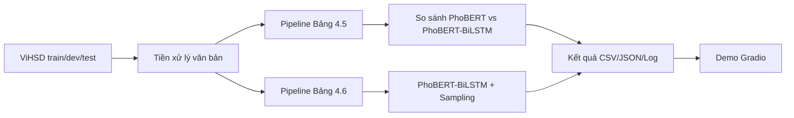

# PhoBiHSD: Phát Hiện Ngôn Ngữ Thù Ghét Tiếng Việt Với PhoBERT-BiLSTM

## Giới thiệu
PhoBiHSD là repo nghiên cứu phát hiện hate speech tiếng Việt trên bộ dữ liệu ViHSD, tập trung vào mô hình đề xuất **PhoBERT-BiLSTM** và pipeline tái lập kết quả theo dạng luận văn.

## Tính năng chính
- Pipeline thí nghiệm tái lập được cho so sánh mô hình (Bảng 4.5) và tác động sampling (Bảng 4.6).
- Hỗ trợ chạy trên `auto/cpu/cuda` qua biến `PHOBIHSD_DEVICE`.
- Có web demo Gradio để suy luận nhanh.
- Hỗ trợ Docker CPU/GPU và image prebuilt từ GHCR.
- Tự tải checkpoint pretrained khi chạy app nếu máy chưa có file model.

## Kiến trúc tổng quan


## Cài đặt
Yêu cầu khuyến nghị:
- Python 3.10+
- pip mới
- (Tùy chọn) CUDA nếu muốn chạy GPU

Cài dependencies:
```bash
python -m pip install --upgrade pip
python -m pip install -r requirements.txt
```

Hoặc cài nhanh bằng script:
```bash
bash scripts/bootstrap_env.sh
```

## Chạy dự án
### 1) Chạy thí nghiệm Bảng 4.5
```bash
export PHOBIHSD_DEVICE=auto   # auto | cpu | cuda
bash scripts/run_model_comparison.sh
```

### 2) Chạy thí nghiệm Bảng 4.6
```bash
export PHOBIHSD_DEVICE=auto   # auto | cpu | cuda
bash scripts/run_table_4_6_sampling_impact.sh
```

### 3) Chạy app Gradio
```bash
export PHOBIHSD_DEVICE=auto
export PHOBIHSD_HOST=0.0.0.0
export PHOBIHSD_PORT=7860
bash scripts/run_gradio_app.sh
```

Mở app tại:
- `http://localhost:7860`

Ghi chú:
- Nếu chưa có `models/phobihsd_proposed.pt`, script sẽ tự tải từ HF repo mặc định `joshswift/phobihsd-proposed`.

### 4) Chạy Docker local (build từ source)
CPU:
```bash
docker compose -f docker-compose.cpu.yml up --build -d
```

GPU:
```bash
docker compose -f docker-compose.gpu.yml up --build -d
```

### 5) Chạy image prebuilt từ GHCR
```bash
docker compose -f docker-compose.ghcr.yml up -d
```

### 6) 1-click trên Windows
- CPU: chạy file `windows/Run-PhoBiHSD.bat`
- GPU: chạy file `windows/Run-PhoBiHSD-GPU.bat`

## Cấu hình môi trường
Biến môi trường quan trọng:
- `PHOBIHSD_DEVICE`: `auto` | `cpu` | `cuda`
- `PHOBIHSD_HOST`: host chạy Gradio (mặc định `0.0.0.0`)
- `PHOBIHSD_PORT`: cổng Gradio (mặc định `7860`)
- `PHOBIHSD_PROPOSED_CKPT`: đường dẫn checkpoint local
- `PHOBIHSD_CONFIG`: file config thí nghiệm
- `PHOBIHSD_HF_REPO`: repo Hugging Face chứa pretrained (mặc định `joshswift/phobihsd-proposed`)

Các file config chính:
- `config/experiments/model_comparison.yaml`
- `config/experiments/sampling_experiment.yaml`

## Cấu trúc thư mục
```text
phobihsd/
├── .github/workflows/           # GitHub Actions (build/push image)
├── app/                         # Gradio app
├── config/experiments/          # YAML cấu hình thí nghiệm
├── data/                        # Dữ liệu
├── docs/                        # Tài liệu
├── experiments/                 # Registry chạy thí nghiệm
├── results/                     # Kết quả
├── scripts/                     # Script chạy pipeline, infer, publish
├── src/                         # Mã nguồn chính
├── windows/                     # 1-click launcher cho Windows
├── Dockerfile.cpu
├── Dockerfile.gpu
├── docker-compose.cpu.yml
├── docker-compose.gpu.yml
├── docker-compose.ghcr.yml
└── requirements.txt
```

## Hướng dẫn đóng góp
1. Tạo branch mới từ `main`.
2. Giữ logic reproducible, ưu tiên config-driven.
3. Trước khi tạo PR, chạy tối thiểu:
```bash
python -m compileall src app scripts
pytest -q
```
4. Cập nhật README hoặc docs nếu có thay đổi flow chạy.

## License
Hiện repo chưa khai báo file `LICENSE` chính thức. Nên bổ sung `LICENSE` (ví dụ MIT/Apache-2.0) trước khi public rộng.

## Roadmap
- Bổ sung CI kiểm tra test + smoke test inference.
- Tinh gọn thêm pipeline và benchmark đa seed.
- Chuẩn hóa model card + versioning cho nhiều checkpoint.
- Hoàn thiện tài liệu triển khai production.
