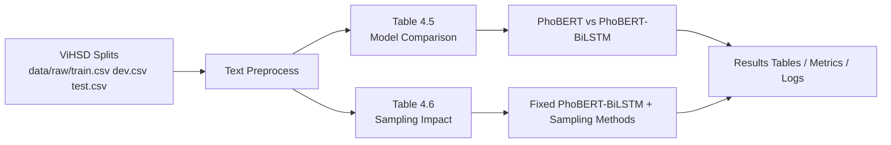

# PhoBiHSD: A Hybrid PhoBERT BiLSTM Approach for Detecting Hate Speech in Imbalanced Vietnamese Social Media Texts

## Introduction
PhoBiHSD is a research repository for Vietnamese hate speech detection on ViHSD with a reproducible thesis-style pipeline.

Current experimental focus:
- **Table 4.5**: primary model comparison between `PhoBERT` and `PhoBERT-BiLSTM (proposed)`.
- **Table 4.6**: impact analysis of data balancing methods with fixed `PhoBERT-BiLSTM`.

## Key Features
- Reproducible experiment structure (`config/`, `src/`, `scripts/`, `results/`, `experiments/`).
- Fixed train/dev/test workflow on local ViHSD split files.
- Sampling methods implemented in code: `ROS`, `ROS+ENN`, `ROS+NearMiss`, `ROS+RUS`, `ROS+Tomek`.
- Automatic metric/log/table exports for thesis reporting.
- Remote worker friendly (tmux-based long runs).

## Architecture Overview


Main modules:
- `src/pipelines/run_model_comparison.py`: Table 4.5 pipeline.
- `src/pipelines/run_sampling_experiment.py`: Table 4.6 pipeline.
- `src/pipelines/build_table_4_6_sampling_impact.py`: Table 4.6 analysis post-processing.

## Installation
### 1) Create environment
```bash
python -m venv .venv
source .venv/bin/activate
```

### 2) Install base dependencies
```bash
pip install -r requirements.txt
```

### 3) Install model dependencies (required for PhoBERT/BiLSTM)
```bash
pip install -r requirements-models.txt
```

## Run the Project
### Run Table 4.5 (default: PhoBERT vs PhoBERT-BiLSTM)
```bash
make run-table-4-5
```

Equivalent command:
```bash
bash scripts/run_model_comparison.sh
```

Output:
- `results/tables/table_4_5_proposed_main.csv`
- `results/metrics/model_comparison_table_4_5.json`
- `results/logs/table_4_5_model_comparison.log`

### Run Table 4.6 (PhoBIHSD + sampling methods)
```bash
make run-table-4-6
```

Equivalent command:
```bash
bash scripts/run_table_4_6_sampling_impact.sh
```

Output:
- `results/tables/table_4_6_sampling_impact.csv`
- `results/tables/table_4_6_sampling_impact_detail.csv`
- `results/tables/table_4_6_sampling_impact_analysis.md`
- `results/metrics/sampling_table_4_6.json`
- `results/figures/confusion_matrix_table_4_6.png`

### Run Web Demo (Gradio, proposed model)
Set checkpoint path, then start the web app:
```bash
export PHOBIHSD_PROPOSED_CKPT=models/phobihsd_proposed.pt
export PHOBIHSD_CONFIG=config/experiments/model_comparison.yaml
bash scripts/run_gradio_app.sh
```

Optional host/port:
```bash
export PHOBIHSD_HOST=0.0.0.0
export PHOBIHSD_PORT=7860
```

Demo files:
- `app/gradio_app.py`
- `src/inference/proposed_predictor.py`

## Environment Configuration
The main experiment configs:
- `config/experiments/model_comparison.yaml` (Table 4.5)
- `config/experiments/sampling_experiment.yaml` (Table 4.6)

Expected dataset files:
- `data/raw/train.csv`
- `data/raw/dev.csv`
- `data/raw/test.csv`

Expected columns:
- text column: `free_text` or `text`
- label column: `label_id` or `label`

## Directory Structure
```text
phobihsd/
├── config/
│   └── experiments/
├── data/
│   └── raw/
├── docs/
├── experiments/
├── results/
│   ├── tables/
│   ├── metrics/
│   ├── figures/
│   ├── logs/
│   └── archives/
├── scripts/
├── src/
│   ├── core/
│   ├── data/
│   ├── processing/
│   ├── evaluation/
│   └── pipelines/
├── tests/
├── requirements.txt
└── requirements-models.txt
```

## Contribution Guide
1. Create a branch for your change.
2. Keep experiment logic reproducible (config-driven, deterministic seed).
3. Run relevant commands before PR:
   - `pytest -q`
   - target pipeline command (`make run-table-4-5` or `make run-table-4-6`)
4. Update report/table docs when experiment outputs change.

## License
License is not specified yet in this repository.
If you plan to publish or distribute, add a `LICENSE` file (for example MIT/Apache-2.0) and update this section.

## Roadmap
- Add dedicated TextCNN and BiGRU trainers to match full baseline table in one pipeline.
- Add automatic markdown report sync from latest CSV/JSON artifacts.
- Add CI checks for lint/tests/config validation.
- Add checkpoint management for long multi-method training runs.
